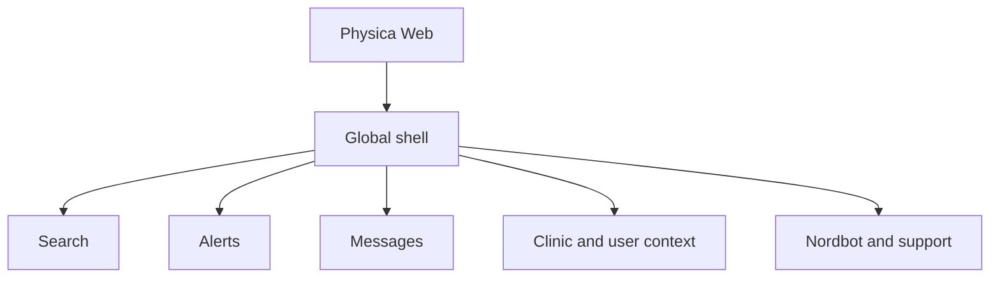

# Mermaid flowchart regression fixture

The HTML renderer should render the following block as a readable, horizontally-scrollable SVG.



The unlabeled form is also supported:

```
graph LR
  A[Start] --> B[Review]
```

Malformed Mermaid must preserve source as a code fallback:

```mermaid
flowchart TD
  This is not valid Mermaid syntax {{{
```

Ordinary code remains a code block:

```swift
let renderer = "HTML"
```
